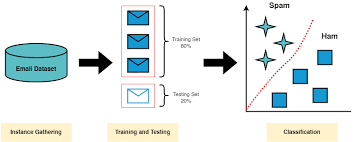

# 📧 Email Spam Prediction

## 📄 Overview

This project aims to build a machine learning model to classify emails as either 'spam' or 'ham' (not spam) using **Logistic Regression**. The model uses textual features extracted from the emails to make predictions. We use the TF-IDF (Term Frequency-Inverse Document Frequency) method to transform the text into numerical features suitable for training a machine learning model.

## 📚 Table of Contents

- [Overview](#-overview)
- [Screenshot]
- [Installation](#-installation)
- [Usage](#-usage)
- [Dataset](#-dataset)
- [Feature Extraction](#-feature-extraction)
- [Model Training](#-model-training)
- [Evaluation](#-evaluation)

## Screenshot

Here's a glimpse of the project in action:

## ⚙️ Installation

### Prerequisites

Ensure you have the following installed:
- 🐍 Python 3.12.2 
- 📒 Jupyter Notebook or any other Python IDE

## Data Preprocessing
Combining Columns: The 'Subject' and 'Body' are combined to form the full message content.
Encoding Labels: 'spam' is encoded as 0 and 'ham' as 1.

## 🔍 Feature Extraction
We use TfidfVectorizer from scikit-learn to convert the email text into TF-IDF feature vectors. This process transforms the text data into a format suitable for machine learning models.

## 🧠 Model Training
Split the dataset into training and testing sets, then train a machine learning model using the training set and apply Logistic Regression Model.

## 📊 Evaluation
Evaluate the model's performance using the testing set. You can use metrics like accuracy score.

